# Network Analysis Project

## Objective
The Network Analysis Project allows a user to capture and analyze netowrk traffic in a safe and controlled environment using Wireshark and tcpdump. The project uses a home lab setup that utilizes a Windows machine and a Kali Linux machine via VirtualBox.

---

## Skills Learned
- Capturing network traffic with tcpdump
- Analyzing network traffic with Wireshark
- Setting up and testing HTTP servers
- Understanding network protocols such as ICMP and HTTP
- Configuring and testing connectivity in a virtual environment

---

## Tools Used
- Virtualization [VirtualBox](https://www.virtualbox.org/)
- Networking: Internal Virtual Network Configuration
- Packet Analysis
  - [tcpdump](https://www.tcpdump.org/): Traffic capture
  - [Wireshark](https://www.wireshark.org/): Traffic analysis
- HTTP Server: IIS (Windows)

---

## Project Workflow

### **1. Project setup**
   - This project assumes that you have a home lab environment set up
   - If you do not, please check out my guide on setting one up [here](https://github.com/TuragIk/Home-Lab)

### **2. Installing tools**
   - We will be using Wireshark and tcpdump on the Kali Linux machine
   - To see if they are installed, run
     ```bash
     wireshark --version
     ```
     and
     ```bash
     tcpdump --version
     ```
   - If you do not see a similar result as below, please continue with this part. Otherwise, you may proceed to step 3

   *Ref 1: Wireshark version*

   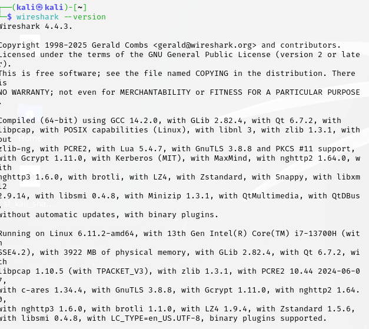

   *Ref 2: tcpdump version*

   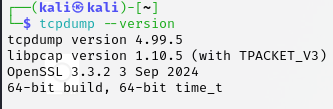

1. If you did not see similar results and your home lab is not connected to the internet, please refer to part 6 of the Home Lab setup [here](https://github.com/TuragIk/Home-Lab)
2. Once connected to the internet, run:
     ```bash
     sudo apt update && sudo apt upgrade -y
     ```
3. To install Wireshark, run:
     ```bash
     sudo apt install wireshark -y
     ```
4. To install tcpdump, run:
     ```bash
     sudo apt install tcpdump -y
     ```
5. Verify both installations using `wireshark --version` and `tcpdump --version` as mentioned above

### **3. Disable the Windows Firewall**
- Within the scope of this project, it is necessary to disable the windows firewall in order to capture and analyze the network data. We will re-enable it in the final step
1. On the Windows machine, open Command Prompt as Administrator
2. Run the following command to disable the firewall:
   ```cmd
   netsh advfirewall set allprofiles state off
   ```

*Ref 3: Disabled Firewall*

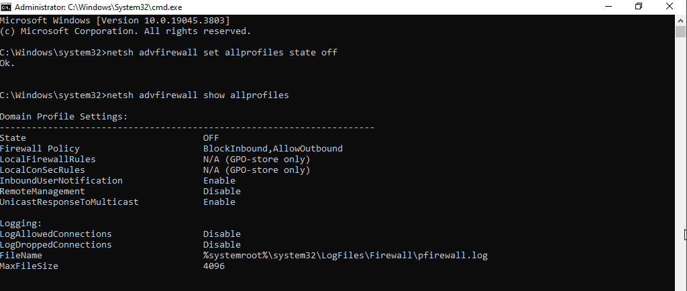

### **4. Set Up IIS on Windows**
- Because our home lab is not connected to the internet, we must simulate network traffic using Windows Internet Information Service
1. Enable IIS:
   - Go to **Control Panel > Programs > Turn Windows Features on or off**
   - Check the box for **Internet Information Services** and click **OK**
2. Confirm IIS is running by navigating to `http://localhost` in a browser

*Ref 4: IIS Default Page*

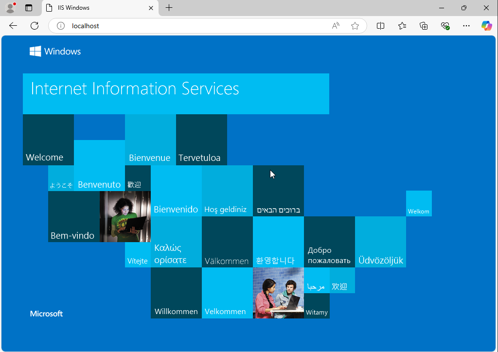

### **5. Validate VM Communication**
1. Ping test
   - From **Kali Linux**, ping the Windows machine:
     ```bash
     ping 192.168.56.102
     ```
     *Note: This ping won't terminate on it's own. Use `Ctrl+C` to force termination.
   - From **Windows**, ping the Kali Linux machine:
     ```bash
     ping 192.168.56.101
     ```

*Ref 5: Kali to Windows ping*

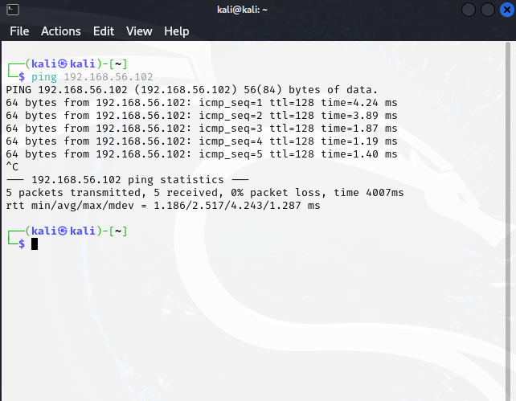

*Ref 6: Windows to Kali ping*

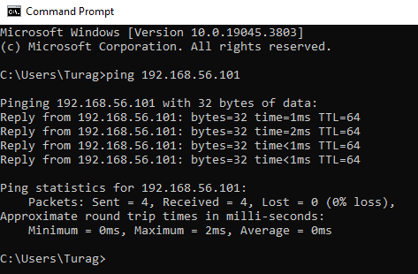

### **6. Test HTTP Connectivity from Kali**
1. Use `curl` on Kali Linux to test HTTP connectivity:
   ```bash
   curl http://192.168.56.102
   ```

*Ref 7: Curl Results*

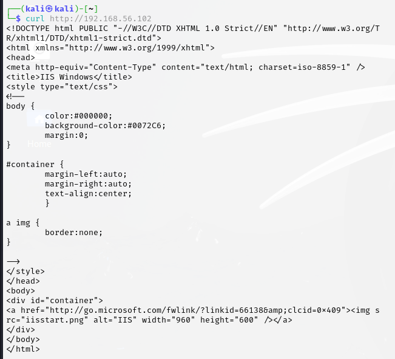

### **7. Capture Traffic with tcpdump**
1. Start capturing traffic on Kali Linux:
   ```bash
   sudo tcpdump -i eth0 -w traffic_capture.pcap
   ```
2. Generate traffic:
   - In a separate terminal:
     - Ping the Windows machine:
     ```bash
     ping 192.168.56.102
     ```
     *After about 10 pings, terminate with `Ctrl+C`*
     - Use `curl` to make an HTTP request:
     ```bash
     curl http://192.168.56.102
     ```
   - In the original terminal, stop tcpdump with `Ctrl+C`

  *Ref 8: tcpdump results*

  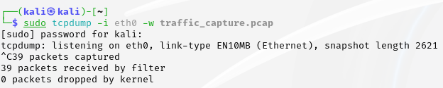

  ### **8. Analyze Traffic with Wireshark**
  1. Open Wireshark on Kali Linux and load `traffic_capture.pcap`. It will be stored in your home directory:
     ```bash
     wireshark
     ```
2. Analyze traffic:
   - **HTTP Traffic**
     - Filter: `http`
     - Examine `HTTP GET` requests and responses
     - Right-click a packet and select **Follow > HTTP Stream**

*Ref 9: Filtered HTTP packets*

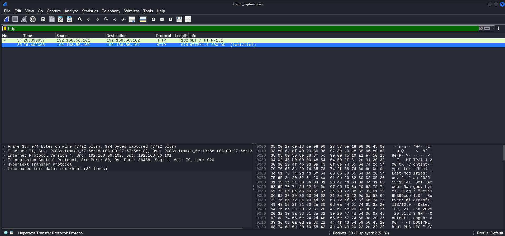

*Ref 10: HTTP stream results. Notice how it is the same as the curl results*

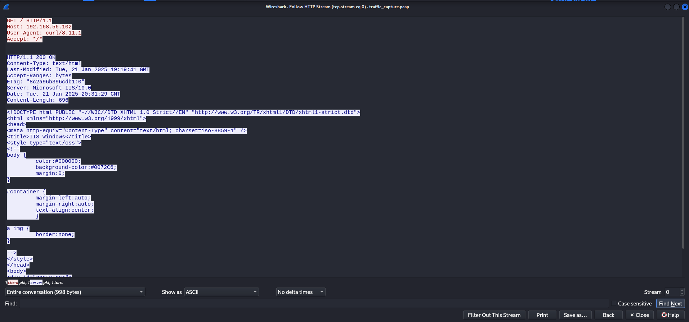

- **ICMP Traffic:
  - Filter: `icmp`
  - View ping requests and responses

*Ref 11: Filtered icmp traffic*

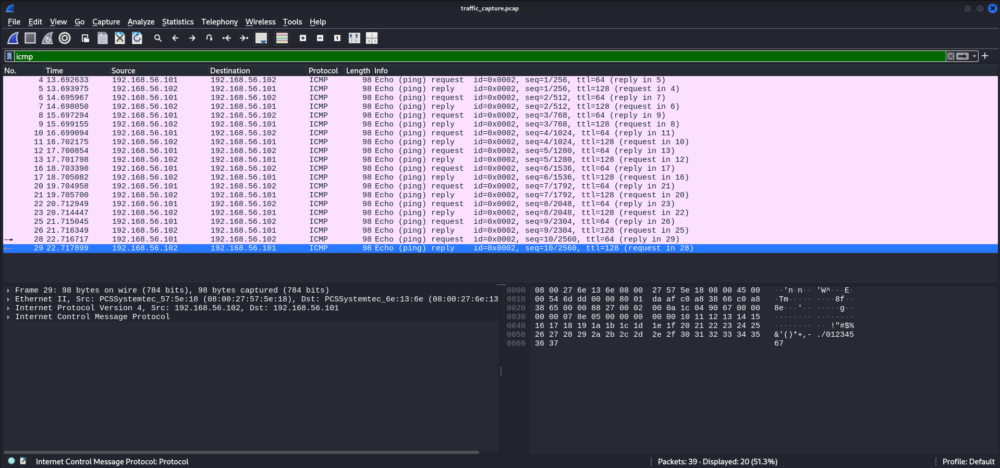

### **9. Re-enable Windows Firewall
1. On the Windows machine, re-enable the firewall:
```bash
netsh advfirewall set allprofiels state on
```
2. Verify the firewall is enabled:
```bash
netsh advfirewall show allprofiles
```

*Ref 12: cmd results after re-enabling firewall*

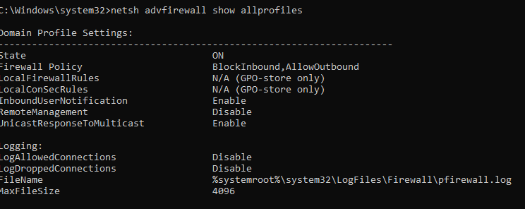

---

### **Conclusion**
Congratulations on completing the network analysis project! Feel free to check out check out my other repositories for my other works!

### **License**
This project is licensed under the MIT License. See the `LICENSE` file for details.


